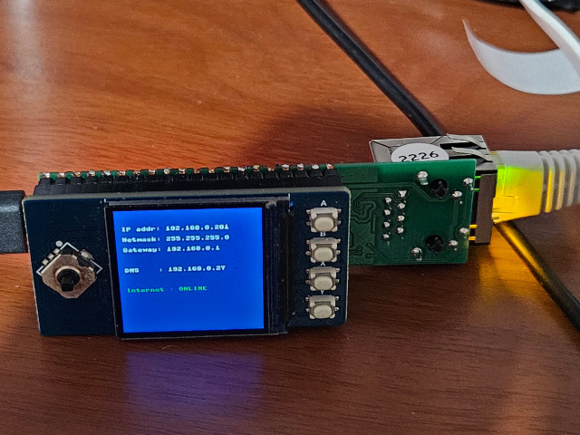

# rj45alive

Raspberrypi Pico based tool to quickly check ethernet RJ45 sockets for connectivity 

- displays ip address and dns
- checks for internet connectivity

  
- WIZnet W5500-EVB-Pico - RP2040 Board with Ethernet
- 1.3" IPS LCD Display Module for Raspberry Pi Pico
